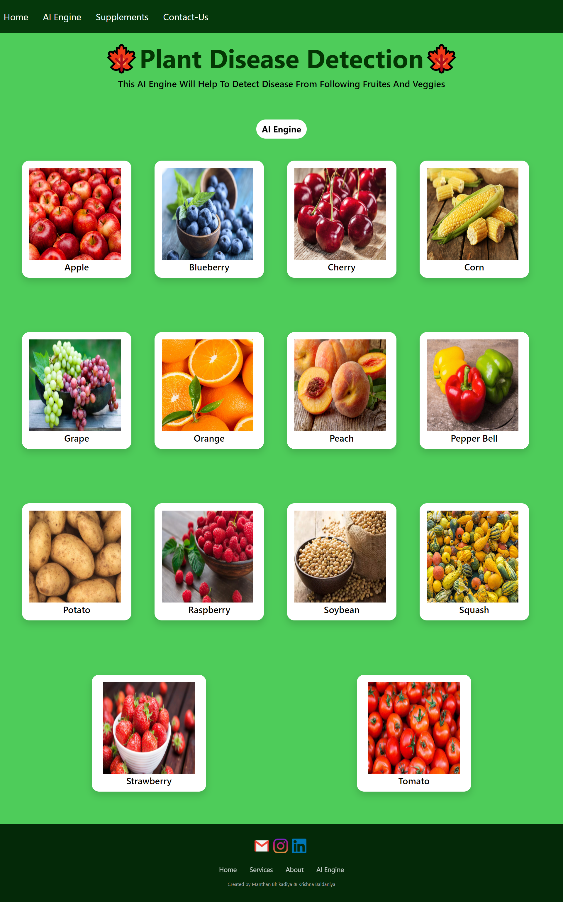
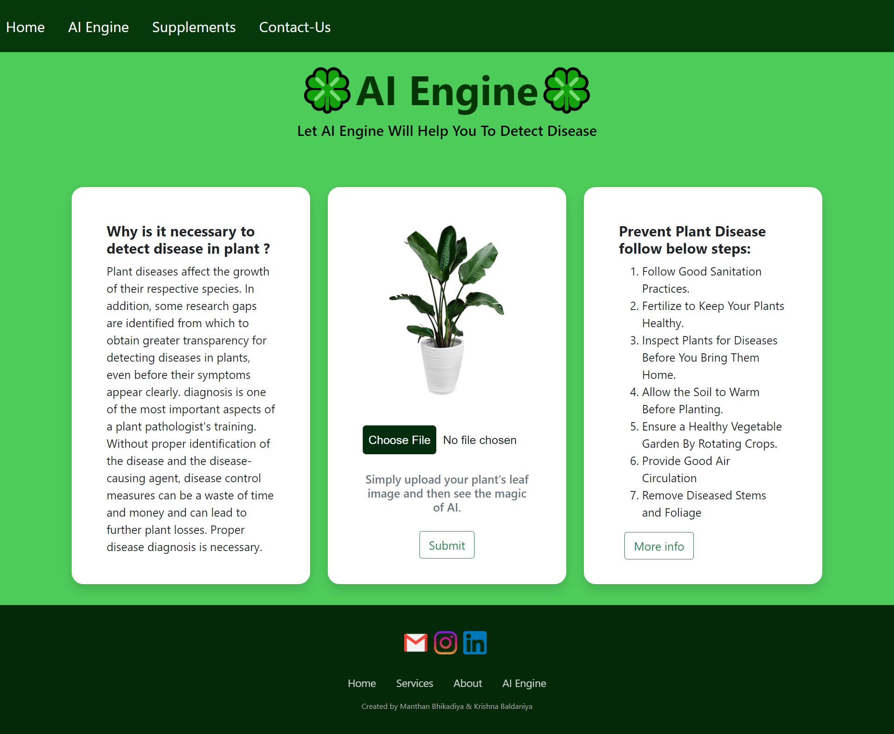
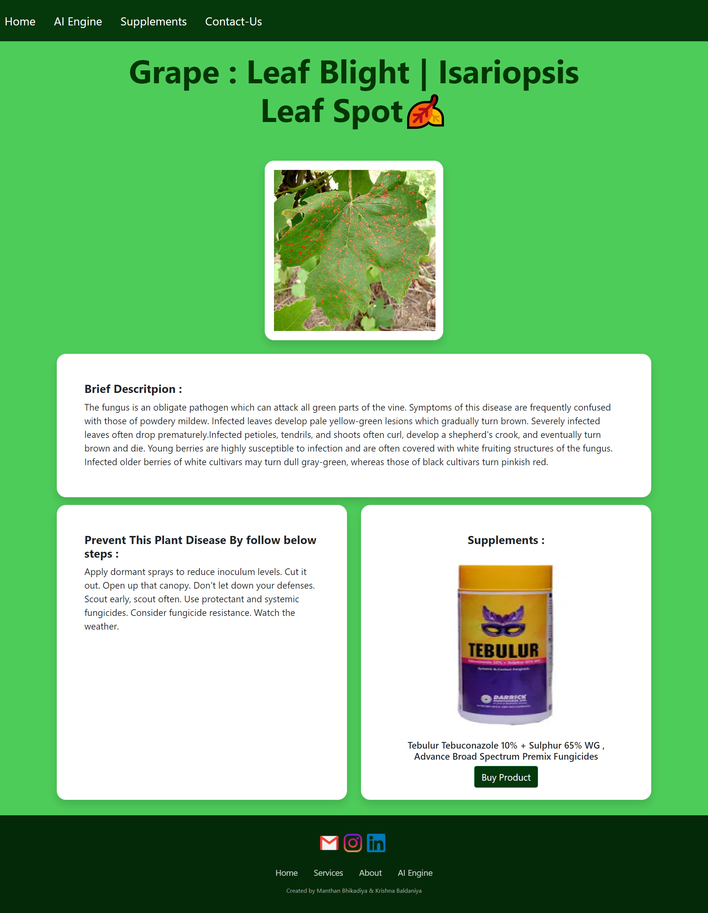
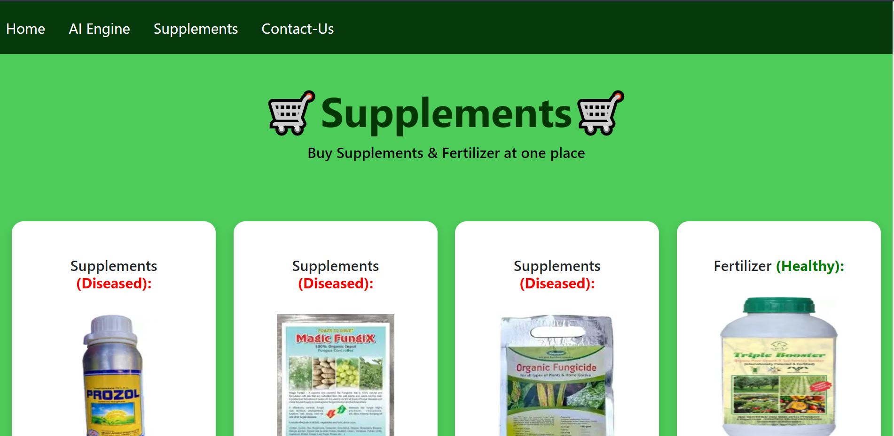
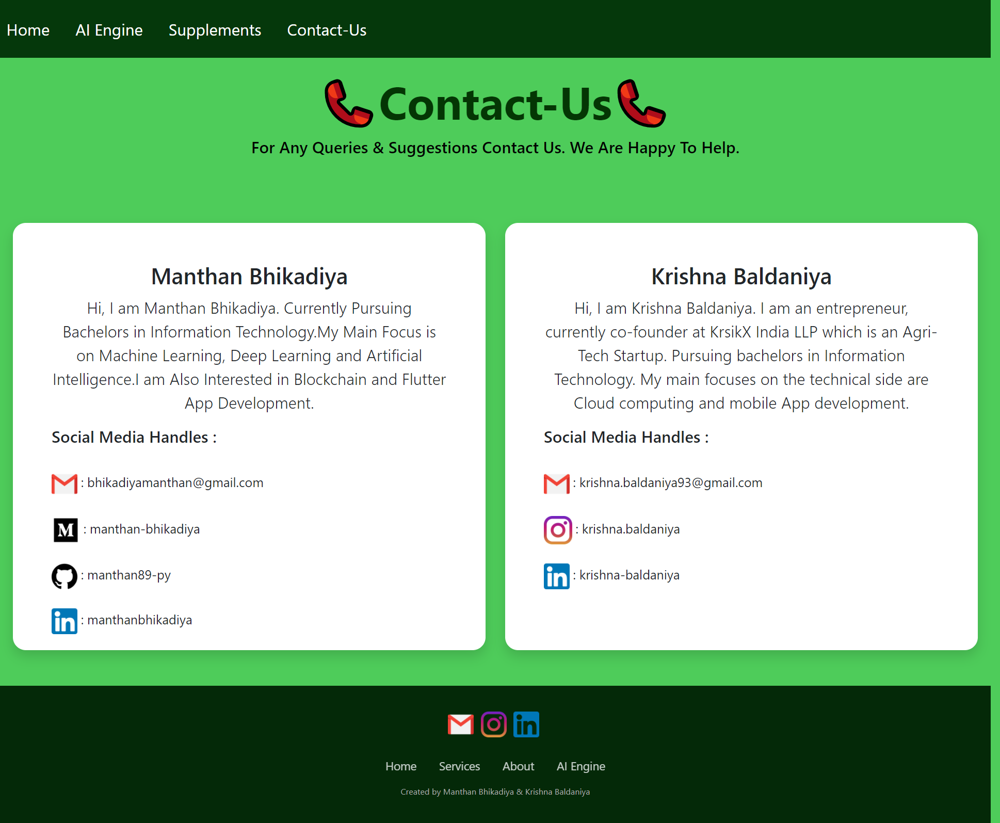

# 🌱 Plant Disease Detection using PyTorch & Flask

Plant Disease Detection is a deep learning system designed to help farmers and gardeners identify crop diseases early. The application uses a Convolutional Neural Network (CNN) built with PyTorch to classify plant leaf images into **38+ distinct categories** (spanning healthy and diseased states across various crops).

---

## 🚀 Features
- **Deep Learning Model**: PyTorch CNN trained on the PlantVillage dataset.
- **Web Interface**: User-friendly Flask application with crop disease detection, detailed disease info, supplement/fertilizer recommendations, and a marketplace.
- **Sample Datasets**: Test images provided in `test_images/` for quick testing.

---

## 🛠️ Project Structure

```text
├── Flask Deployed App/         # Web Application (Flask, PyTorch Model, Templates, Static Assets)
│   ├── app.py                  # Main Flask Server Script
│   ├── CNN.py                  # CNN Model Architecture Definition
│   ├── disease_info.csv        # Disease Descriptions & Treatment Guidance
│   ├── supplement_info.csv     # Supplement & Fertilizer Recommendations
│   ├── requirements.txt        # Python Dependencies
│   ├── static/                 # CSS, Icons, JS, and Uploaded Images
│   └── templates/              # HTML Templates (Bootstrap UI)
├── Model/                      # Model Training Notebooks & Code
│   ├── Plant Disease Detection Code.ipynb
│   ├── Plant Disease Detection Code.md
│   └── Plant Disease Detection-code.pdf
├── demo_images/                # UI Demonstration Screenshots
├── test_images/                # Sample Images for Testing
├── .gitignore                  # Git Exclusion Rules
└── README.md                   # Project Documentation
```

---

## 💻 Getting Started

### 1. Prerequisites
- Python 3.8+ installed on your system.

### 2. Installation & Setup

1. **Clone the repository**:
   ```bash
   git clone https://github.com/YOUR_USERNAME/Plant-Disease-Detection.git
   cd Plant-Disease-Detection
   ```

2. **Create and activate a virtual environment**:
   - **Linux / macOS**:
     ```bash
     python3 -m venv .venv
     source .venv/bin/activate
     ```
   - **Windows (PowerShell)**:
     ```powershell
     python -m venv .venv
     .\.venv\Scripts\Activate.ps1
     ```

3. **Install Dependencies**:
   ```bash
   pip install -r "Flask Deployed App/requirements.txt"
   ```

4. **Download Model Weights**:
   - Download `plant_disease_model_1_latest.pt` (or `plant_disease_model_1.pt`) from the [Google Drive Link](https://drive.google.com/drive/folders/1ewJWAiduGuld_9oGSrTuLumg9y62qS6A?usp=share_link).
   - Place the downloaded `.pt` file inside the `Flask Deployed App/` directory.

---

## 🏃 Running the Application

1. Navigate to the Flask application folder:
   ```bash
   cd "Flask Deployed App"
   ```

2. Launch the Flask web app:
   ```bash
   python app.py
   ```

3. Open your browser and navigate to:
   ```text
   http://127.0.0.1:5000/
   ```

---

## 🧪 Testing with Sample Images
- Use any leaf image from the `test_images/` directory to test disease predictions. Each file is named according to its crop and disease class.

---

## 📖 Related Articles & Resources
- **Medium Article**: [Plant Disease Detection Using Convolutional Neural Networks with PyTorch](https://medium.com/analytics-vidhya/plant-disease-detection-using-convolutional-neural-networks-and-pytorch-87c00c54c88f)

---

## 🤝 Contributing
Contributions are welcome! Feel free to submit bug reports, feature requests, UI enhancements, or model performance improvements via Pull Requests.

---

## 🖼️ Application Preview

#### Main Home Page


#### AI Prediction Engine


#### Detailed Results & Remedies


#### Supplement Store


#### Contact Us

